# Travel Management System

## Overview

The **Travel Management System** is a full-stack web application designed to streamline the process of managing travel packages, bookings, and user interactions. It provides a secure and feature-rich platform for both admins and customers, ensuring a seamless experience in booking and managing trips.

---

## Features

### 1. User Authentication
- Secure login system for Admin and Customer roles.
- Role-Based Access Control (RBAC) for managing permissions:
  - **Admin**: Manage packages, bookings, and reviews.
  - **Customer**: Browse, book trips, and provide feedback.
- Comprehensive user management with fields like `UserId`, `Username`, `PasswordHash`, `Role`, `Email`, and `IsActive`.

### 2. Package Management
- Admins can:
  - Add, update, or delete travel packages with details such as itinerary, price, and availability.
  - Manage package availability in real-time.
- Customers can:
  - Browse packages using filters like destination, theme (adventure, leisure, etc.), and duration.

### 3. Booking System
- Customers can:
  - Book travel packages with date and group size selection.
  - Receive booking confirmation via email.
- Admins can:
  - Track and confirm bookings in real-time.

### 4. Advanced Search and Filtering
- Customers can:
  - Search packages based on destination, price range, and theme.
  - Access seasonal offers, group discounts, and special promotions.

### 5. User Dashboards
- **Customer Dashboard**:
  - View booking history, current bookings, and trip itineraries.
- **Admin Dashboard**:
  - Monitor booking trends and analyze data on popular destinations and seasonal demands.

### 7. Feedback System
- Customers can:
  - Provide feedback and ratings on booked packages.
- Admins can:(pending)
  - Use feedback to improve package quality and customer satisfaction.

---

## Tech Stack

- **Frontend**: Angular 17
- **Backend**: Node.js with Express.js
- **Database**: MySQL

---

# Application Screenshots

Below is a systematic view of the application's UI with screenshots and a brief description of each.

---

### General Screens
1. **Landing Page**  
   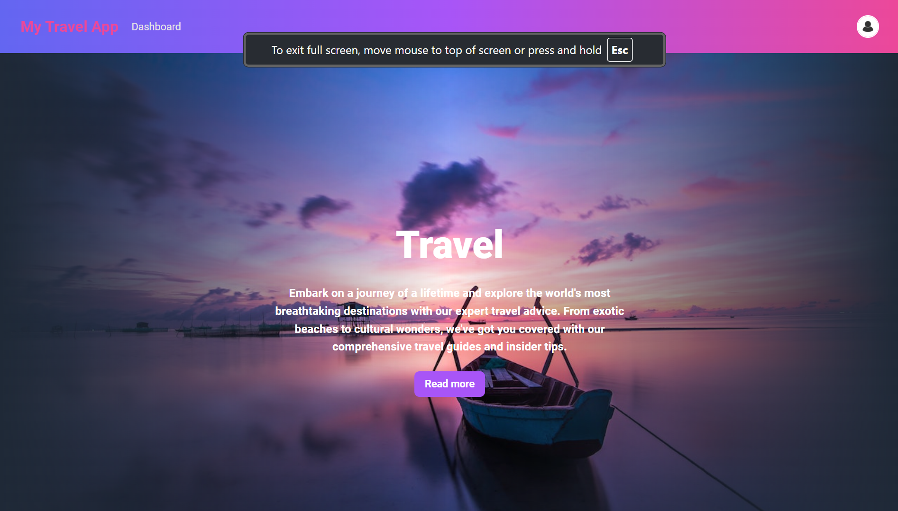  
   (This is the main landing page of the application.)

2. **Login Page**  
   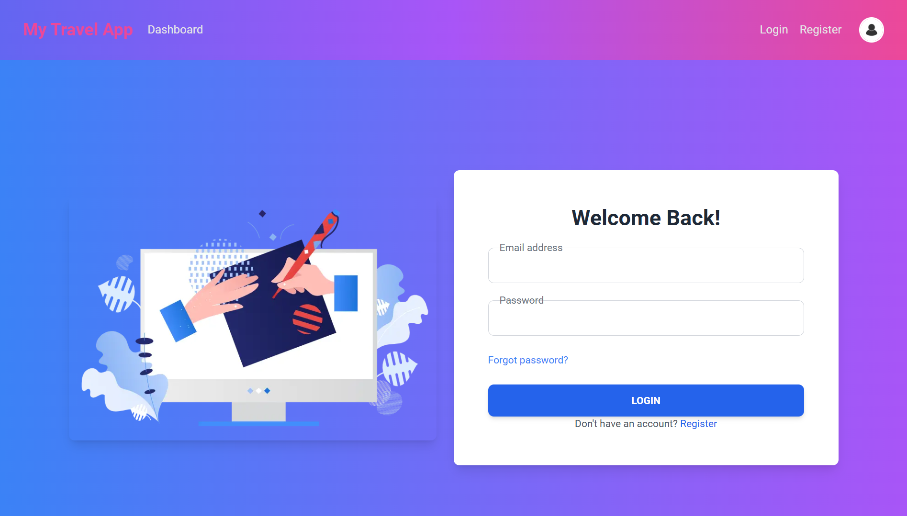  
   (Allows users to log in to their account.)

3. **Sign-Up Page**  
   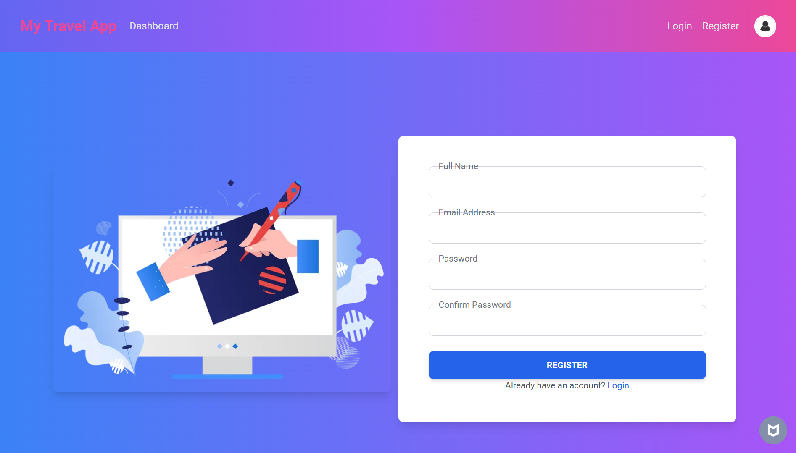  
   (Users can register for a new account.)

4. **Logged-In Model**  
   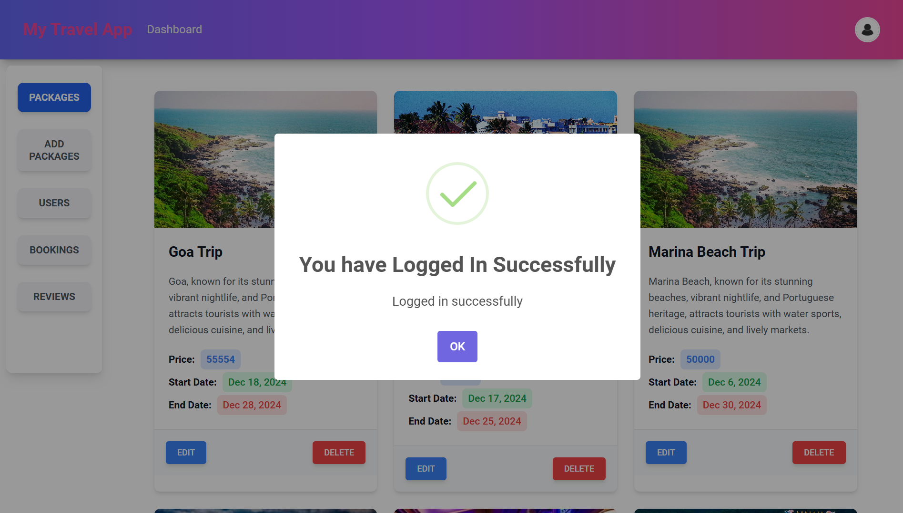  
   (Displays a modal confirming the user is logged in.)

---

### Admin Role
If the user has an admin role, they are redirected to the admin route:

1. **Admin - Packages**  
     
   (Displays all packages for the admin to manage.)

2. **Admin - Edit Package**  
   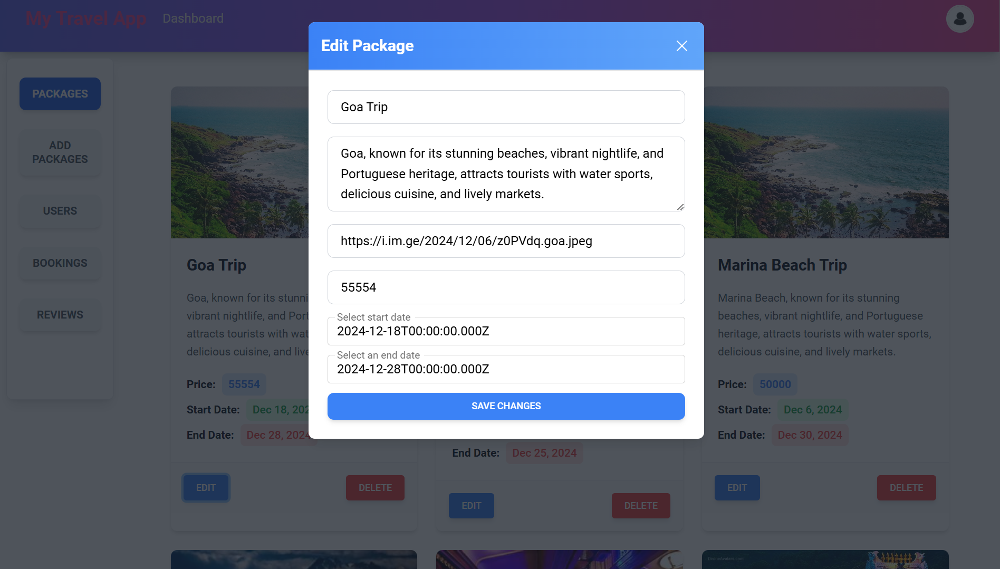  
   (A modal allowing the admin to edit a package's details.)

3. **Admin - Delete Package**  
   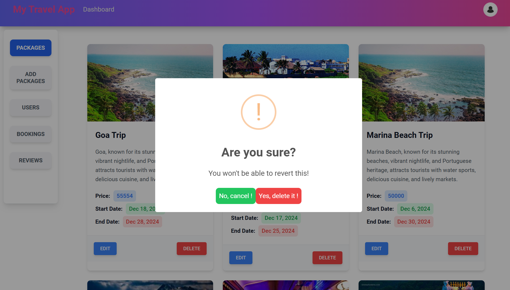  
   (A modal confirming the deletion of a package.)

4. **Admin - Add Package**  
   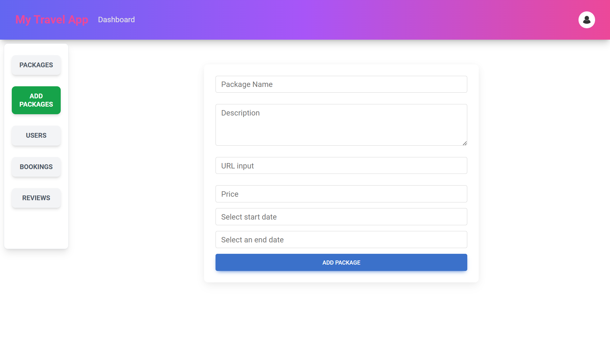  
   (Admin can add new packages to the list.)

5. **Admin - Bookings**  
   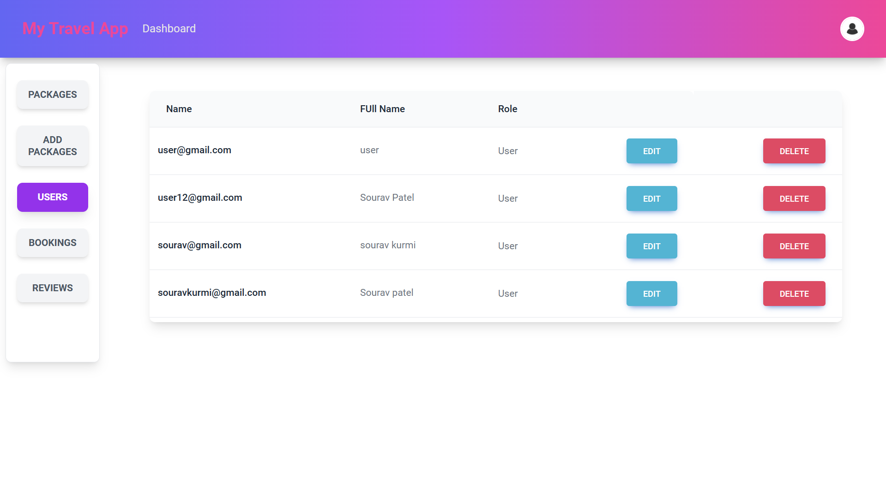  
   (Displays a list of all bookings for admin review.)

6. **Admin - Users**  
   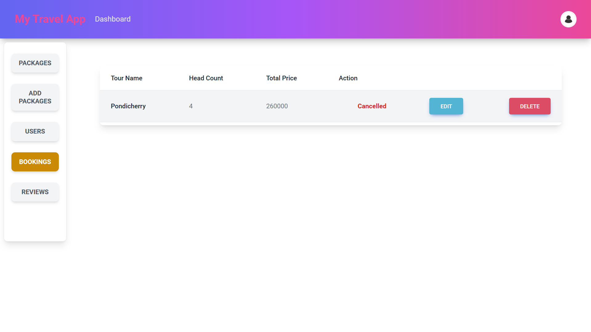  
   (Admin can view and manage all users.)

7. **Admin - Reviews**  
   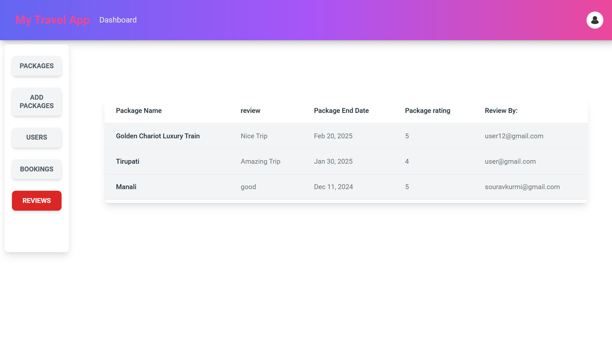  
   (Displays reviews given by users on packages.)

---

### User Role
If the user has a regular user role, they are redirected to the user route:

1. **User - Packages**  
   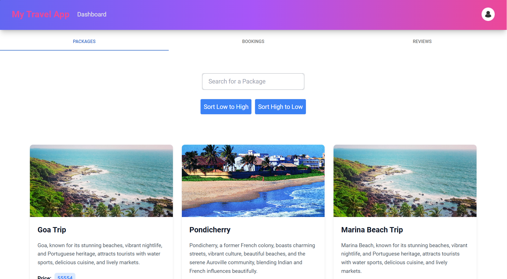  
   (Displays all available packages for users.)

2. **User - Bookings**  
   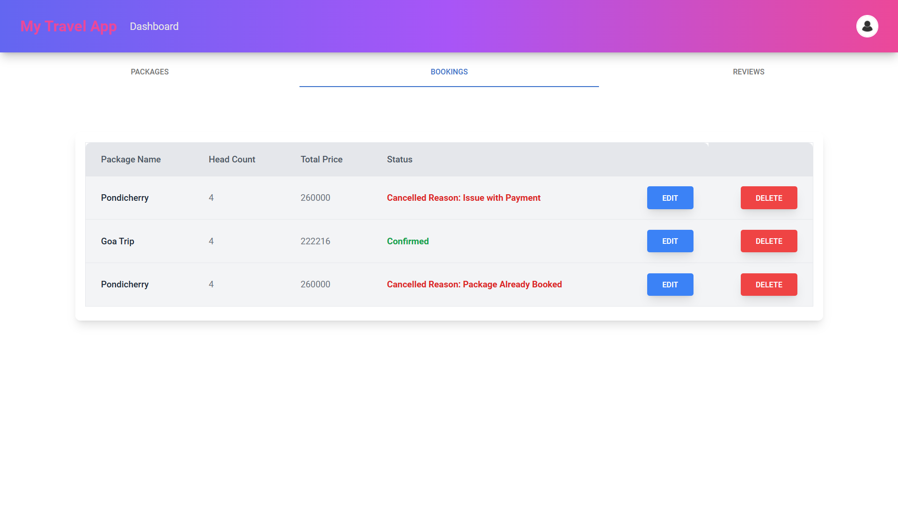  
   (Users can view and manage their bookings here.)

3. **User - Reviews**  
   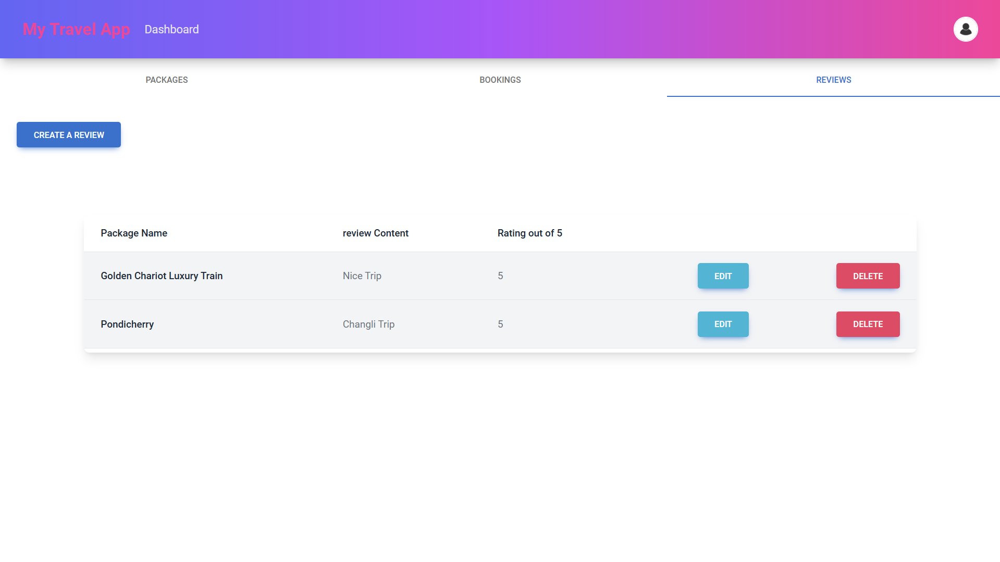  
   (Users can give reviews for trips they have taken.)

4. **Add Review Modal**  
   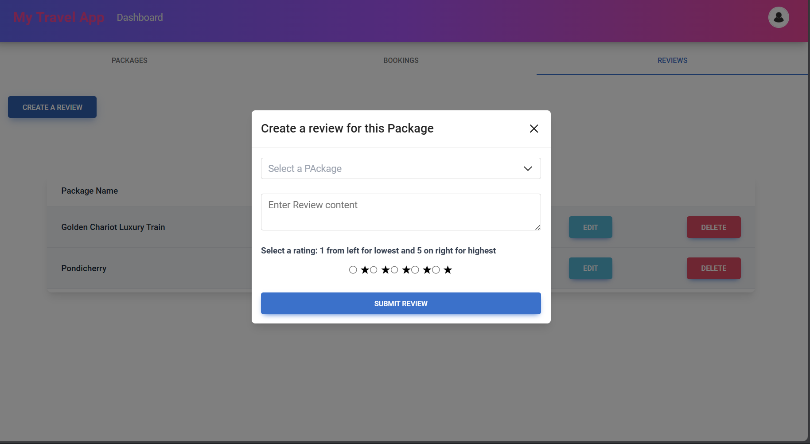  
   (Modal for users to add a review.)

---

### Profile Management
1. **User/Admin Profile**  
   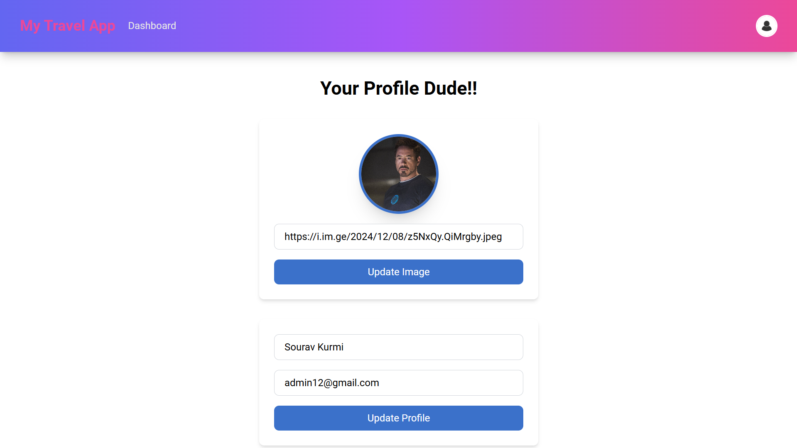  
   (Both users and admins can view and edit their profile information here.)

---

### Notification Management
1. **User/Admin Notification**  
   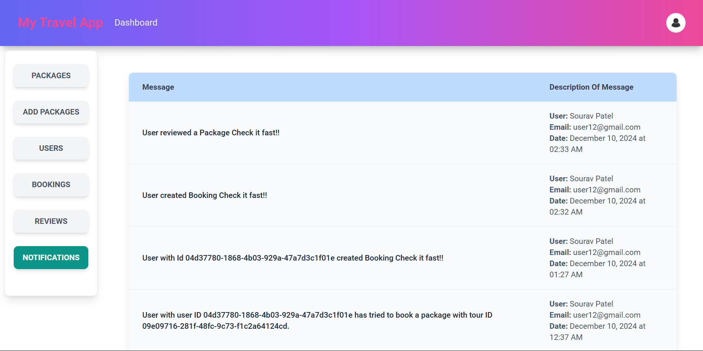  
   (Both users and admins can be notified in realtime)
---

### Analytics for Admin
1. **User/Admin Notification**  
   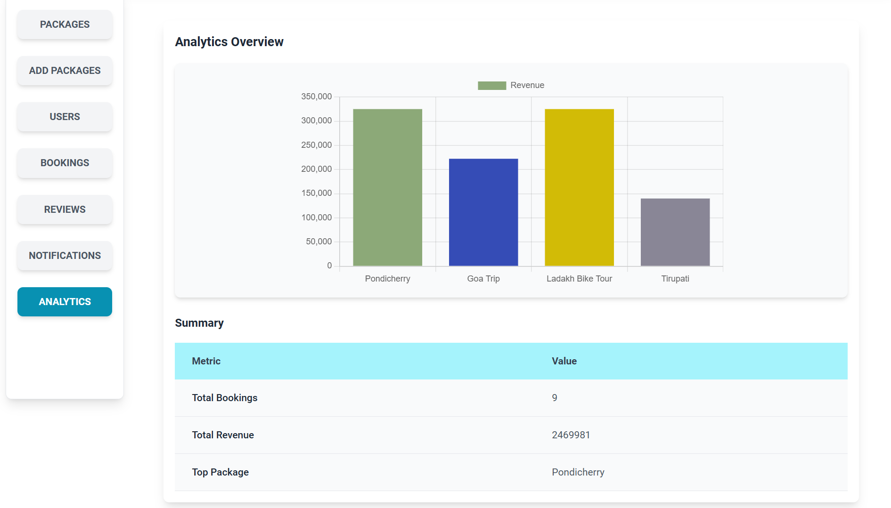  
   (Admins can track the revenues of each package booked along with total bookings and total revenue)
   